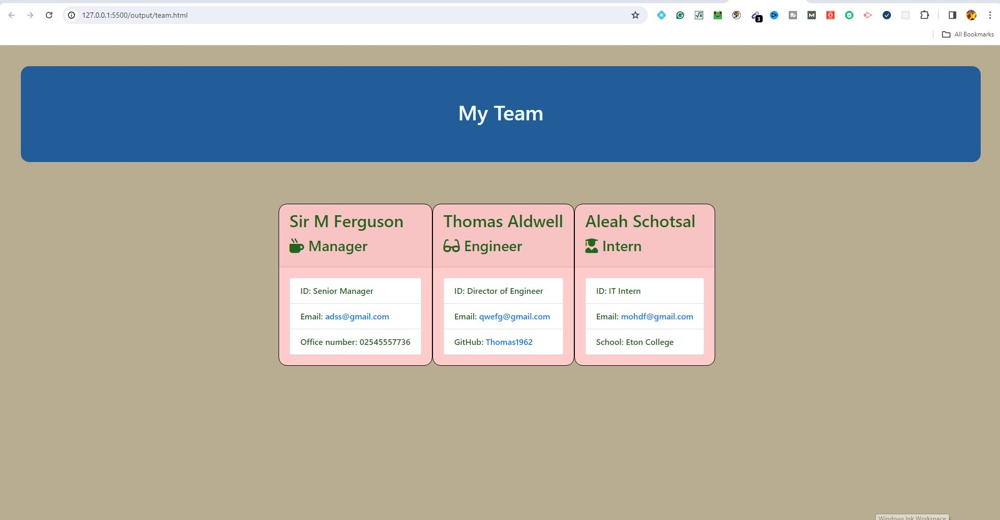

# Team-Profile

This is a command line Team Profile Generator.
In here HTML flie is created by using input from a command-line interface.

# User Story

This app is very helpful for a Manager to see his/ her employees basic information and quickly access to their ID.

# GitHub repository
Clone the repository to your local machine with SSH.
git clone https://github.com/Bilkis2023/Team-Profile.git

To install the required dependencies, run the following command in a terminal:
`npm install inquierer`

Technology Used

- HTML
- CSS
- JavaScript

## image

# Instruction
  
  * Create a command-line application that accepts user input using the provided starter code.   
  * Create classes for each team member provided and export them. The tests for these classes 

    * The first class is an `Employee` parent class with the following properties and methods:       
      - name
      - id
      - email
      - getName()
      - getId()
      - getEmail()
      - getRole() Employee     
         
    * In addition to `Employee`'s properties and methods, `Manager` will also have the following:
      - officeNumber
      - getRole() &mdash;overridden to return `'Manager'`
    - In addition to `Employee`'s properties and methods, `Engineer` will also have the following:
      - github &mdash;GitHub username
      - getGithub()
      - getRole() &mdash;overridden to return `'Engineer'`
    * In addition to `Employee`'s properties and methods, `Intern` will also have the following:
      - school
      - getSchool()
      - getRole() &mdash;overridden to return `'Intern'`
    * Finally, although it’s not a requirement, consider adding validation to ensure that user input is in the proper format.   
  * Write code in `index.js` that uses inquirer to gather information about the development team members and creates objects for each team member using the correct classes as blueprints.
    * When a user starts the application then they are prompted to enter the *team manager*’s:
      - Name
      - Employee ID
      - Email address
      - Office number
    * When a user enters those requirements then the user is presented with a menu with the option to:
      - Add an engineer
      - Add an intern 
      - Finish building the team
    * When a user selects the *engineer* option then a user is prompted to enter the following and then the user is taken back to the menu:
      - Engineer's Name
      - ID
      - Email
      - GitHub username
    * When a user selects the intern option then a user is prompted to enter the following and then the user is taken back to the menu:
      - Intern’s name
      - ID
      - Email
      - School
    * When a user decides to finish building their team then they exit the application, and the HTML is generated.

   :point_right: # MIT License

Copyright (c) 2024  Mst Bilkis Naher

Permission is hereby granted, free of charge, to any person obtaining a copy
of this software and associated documentation files (the "Software"), to deal
in the Software without restriction, including without limitation the rights
to use, copy, modify, merge, publish, distribute, sublicense, and/or sell
copies of the Software, and to permit persons to whom the Software is
furnished to do so, subject to the following conditions:

The above copyright notice and this permission notice shall be included in all
copies or substantial portions of the Software.

THE SOFTWARE IS PROVIDED "AS IS", WITHOUT WARRANTY OF ANY KIND, EXPRESS OR
IMPLIED, INCLUDING BUT NOT LIMITED TO THE WARRANTIES OF MERCHANTABILITY,
FITNESS FOR A PARTICULAR PURPOSE AND NONINFRINGEMENT. IN NO EVENT SHALL THE
AUTHORS OR COPYRIGHT HOLDERS BE LIABLE FOR ANY CLAIM, DAMAGES OR OTHER
LIABILITY, WHETHER IN AN ACTION OF CONTRACT, TORT OR OTHERWISE, ARISING FROM,
OUT OF OR IN CONNECTION WITH THE SOFTWARE OR THE USE OR OTHER DEALINGS IN THE
SOFTWARE.

 